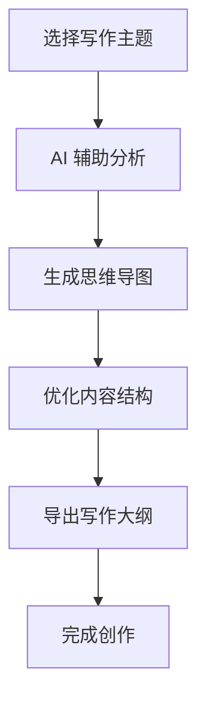

# Topic_Writer_Flow

一个基于 AI 的智能写作辅助工具，帮助创作者高效地梳理思路、生成内容大纲并完成创作。

## 应用场景

- 📝 文章写作与内容创作
- 📚 学术论文结构梳理
- 📊 工作报告编写
- 🎯 项目策划与提案
- 📖 小说与剧本创作
- 🎨 内容营销策划

## 创作流程



## 功能特点

### 核心功能
- 🤖 自动从选题文件读取主题
- 🔍 使用 EXA AI 进行深度内容检索
- ✍️ 通过 DeepSeek 生成高质量文章
- 🖼️ 自动从 Unsplash 获取免费配图
- 📱 同时支持微信公众号和小红书两个平台
- ⏰ 支持定时自动化生成内容

### 用户体验
- 🎯 直观的思维导图式界面
- 📑 支持多层级大纲结构
- 💾 实时保存编辑内容
- 🎨 简洁优雅的设计风格
- 🚀 无需登录即可使用

## 快速上手

1. **环境准备**
```bash
git clone https://github.com/your-username/Topic_Writer_Flow.git
cd Topic_Writer_Flow
pip install -r requirements.txt
```

2. **配置密钥**
- 复制 `.env.example` 为 `.env`
- 填入必要的 API 密钥：
  - EXA_API_KEY
  - DEEPSEEK_API_KEY
  - UNSPLASH_API_KEY

3. **开始使用**
```bash
python main.py
```

## 系统要求

- Python 3.9+
- 现代浏览器（Chrome、Firefox、Safari、Edge 等）
- 网络连接（用于 AI 服务调用）

## 使用技巧

1. **主题创建**
   - 使用清晰的关键词
   - 设定合适的写作目标
   - 选择适当的写作风格

2. **结构优化**
   - 运用思维导图模式
   - 灵活调整层级关系
   - 注重逻辑连贯性

3. **内容生成**
   - 利用 AI 辅助分析
   - 参考推荐的写作模板
   - 适时添加素材图片

## 未来计划

### 近期计划（1-3个月）
- [ ] 支持导出为多种文件格式（Word、PDF、Markdown）
- [ ] 添加在线协作功能
- [ ] 集成更多 AI 模型选项
- [ ] 优化用户界面体验

### 中期计划（3-6个月）
- [ ] 添加自定义模板系统
- [ ] 支持多语言创作
- [ ] 引入版本控制功能
- [ ] 开发移动端应用

### 长期计划（6个月以上）
- [ ] 建立创作者社区
- [ ] 提供专业版订阅服务
- [ ] 开发插件系统
- [ ] 支持更多内容平台对接

## 常见问题

1. **如何备份数据？**
   - 系统会自动保存到本地存储
   - 支持手动导出备份文件
   - 建议定期导出重要内容

2. **遇到技术问题？**
   - 查看详细文档
   - 提交 Issue
   - 联系技术支持

## 作者信息

- 👤 作者：玄清
- 📧 邮箱：grow8org@gmail.com
- 🌐 博客：[天天悦读](https://blog.grow8.org)
- 💻 GitHub：[whotto](https://github.com/whotto)

## 贡献指南

1. Fork 本项目
2. 创建特性分支
3. 提交更改
4. 推送到分支
5. 创建 Pull Request

## 开源协议

本项目采用 MIT License 开源协议。

## 致谢

感谢以下开源项目的支持：
- EXA AI
- DeepSeek
- Unsplash
- OpenRouter

---

如果您觉得这个项目有帮助，欢迎给个 ⭐️ Star！ 